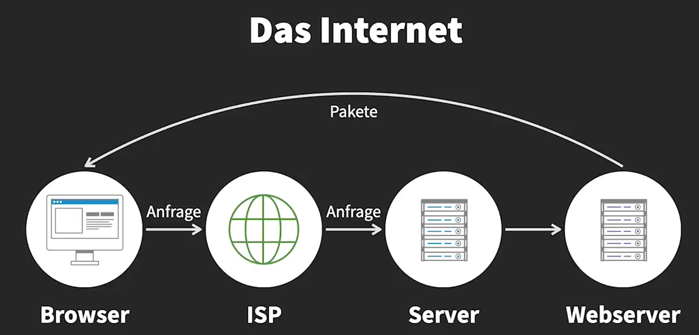
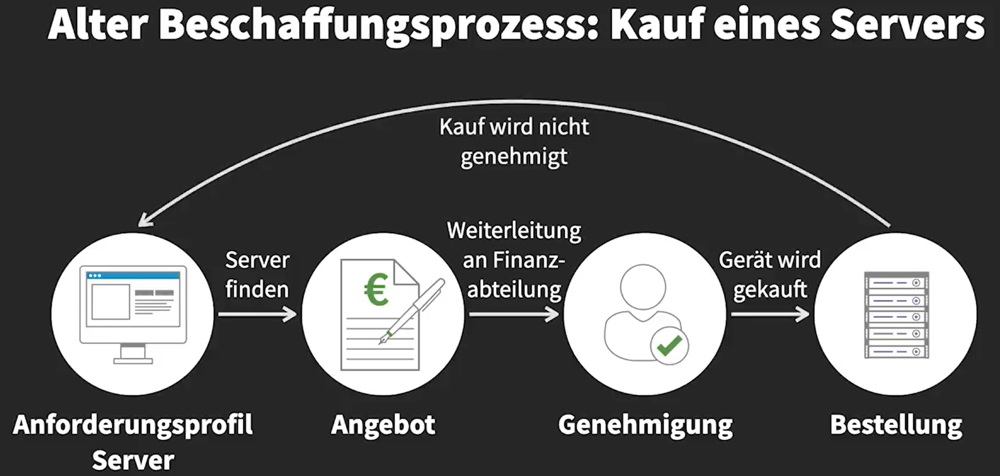

# Cloud-Konzepte

[AWS](https://us-east-2.console.aws.amazon.com/console/home?region=us-east-2)

Das ist das Prinzipen des Cloud-Computings, die Benutzung aus Ressourcen von viele Systems.

*Operational Excellence:*

The Operational Excellence pillar includes the ability to support development and run workloads
effectively, gain insight into their operation, and continuously improve, supporting processes and
procedures to delivery business value.

Design Principles:
- Perform operations as code
- Make frequent, small, reversible changes
- Refine operations procedures frequently
- Anticipate failure
- Learn from all operational failures

*Reliability:*

Design principles:
- Automatically recover from failure
- Test recovery procedures
- Scale horizontally to increase aggregat workload availability
- Stop guessing capacity
- Manage change in automation

*AWS CAF :* AWS Cloud Adoption Framework.

Is a guide to help organization to make the transition of their infrastructure into the cloud.
[Mehr erfahren](https://aws.amazon.com/cloud-adoption-framework/)

The Framework (CAF) is structured in 6 key perspectives.

