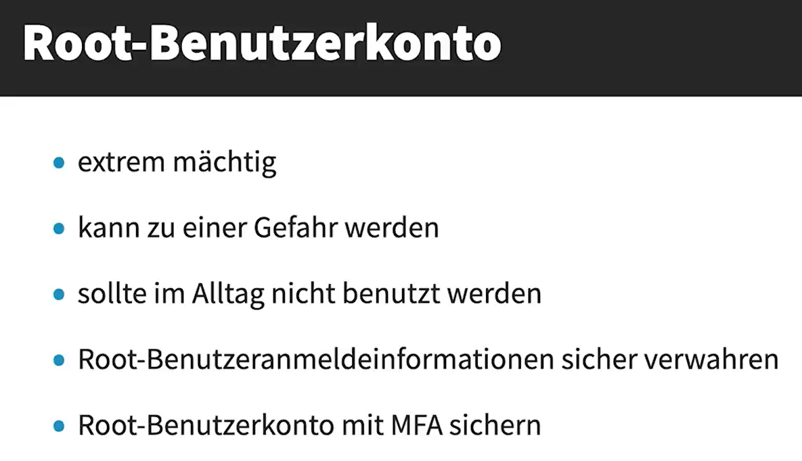

# Sicherheit und Compliance

The customer is responsible for the following:

Summary of customer's responsabilities:

1. Data: Including encryption options and data classification.
2. Applications: Any application software or utilities installed on AWS services.
3. Guest Operating System: Updates, security patches, and configuration.
4. Identity and Access Management (IAM): Applying appropriate permissions and managing user access.
5. Network Security: Configuring security groups and network access control lists (NACLs).

AWS' responsabilities: 
- Handling the security of the cloud infrastructure, while customers are responsible for security in the cloud.
- Installing patches in the cloud.

However, installing patches is a shared responsibility, it depends on which patches we are talking about.
- Installing security patches for the Xen and KVM hypervisors (AWS)
- Installing operating system patches for Amazon DynamoDB (AWS)
- Installing operating system security patches for Amazon RDS database instances (AWS)
- Installing operating system security patches for Amazon EC2 database instances (Customer)

Security Groups and Network Access Control Lists (NACLs) are both critical components for managing security within AWS, but they serve different purposes and operate at different levels.

*Security Groups:*
- Instance-Level Firewall: Security groups act as virtual firewalls for EC2 instances, controlling inbound and outbound traffic.
- Stateful: If you allow inbound traffic, the corresponding outbound traffic is automatically allowed.
- Rules: Security groups only support "allow" rules. By default, all inbound traffic is denied, and you must explicitly allow desired traffic.
- Rule processing: They evaluate all rules before allowing traffic

*Network Access Control Lists (NACLs):*
- Subnet-Level Firewall: NACLs act as firewalls for subnets within your VPC, controlling traffic to and from the subnet.
- Stateless: You must create rules for both inbound and outbound traffic separately.
- Rules: NACLs support both "allow" and "deny" rules. By default, they allow all inbound and outbound traffic for IPv4.
- Rule processing: They process rules in order, starting with the lowest numbered rule, when deciding whether to allow traffic

*Key Differences:*
- Level of Operation: Security groups operate at the instance level, while NACLs operate at the subnet level.
- Statefulness: Security groups are stateful, whereas NACLs are stateless.
- Rule Types: Security groups only allow rules, while NACLs can both allow and deny rules.

Using both security groups and NACLs together can provide a robust, layered security approach for your AWS environment.

>[!Note]
> A *Security Group* is a virtual firewall that controls inbound and outbound traffic for an Amazon EC2 instance

- *IAM:* Identity Access Management

>[!Note]
> Service Control Policies (SCPs) are IAM-like policies to manage permissions in AWS Organizations.
> SCPs restrict the actions allowed for accounts within the organization making each one of them
> compliant with your guidelines.

There are only a few tasks that require you to use the root user:
- Change your account settings. This includes the account name, email address, root user
password, and root user access keys
- View certain tax invoices
- Close your AWS account.
- Restore IAM user permissions
- Change your AWS Support plan or Cancel your AWS Support plan.

**5 Kategorien:**
- Kostenoptimierung
- Leistung
- Sicherheit
- Fehlertoleranz
- Dienstleistungsgrenzen

>[!Note]
> AWS Artifact provides on-demand downloads of AWS security and compliance documents, such as AWS
> ISO certifications, Payment Card Industry (PCI), and Service Organization Control (SOC) reports.

**Governance und Compliance Services:** Sie bei der Governance und Compliance in der AWS-Infrastruktur helfen können.

Dies sind:
- Amazon CloudWatch
- AWS CloudTrail
- AWS Audit Manager
- AWS Config

>[!Note]
> *Amazon Macie* uses machine learning to help discover,monitor, and protect sensitive data that is stored in Amazon S3 buckets.

Um Sicherheitsinformationen zu holen, clicken Sie hier unten:

[AWS Knowledge Center](https://repost.aws/knowledge-center)

The AWS Trust & Safety team can assist you when AWS resources are used to engage in the following types of
abusive behavior:

- Spam
- Port scanning
- Denial-of-service (DOS) attacks
- Intrusion attempts
- Hosting prohibited content
- Distributing malware