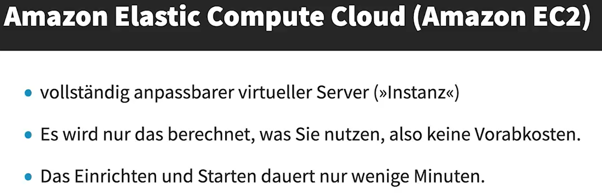
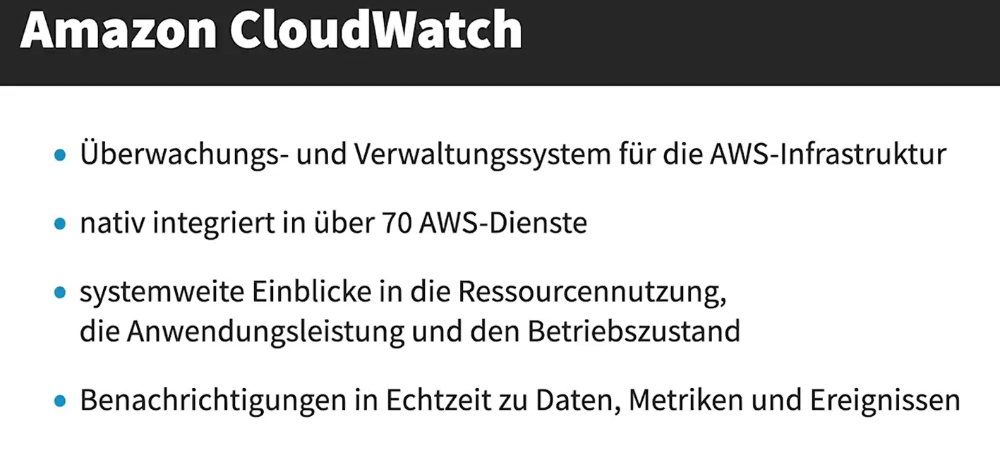
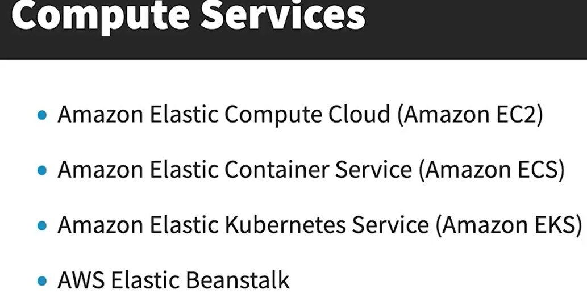
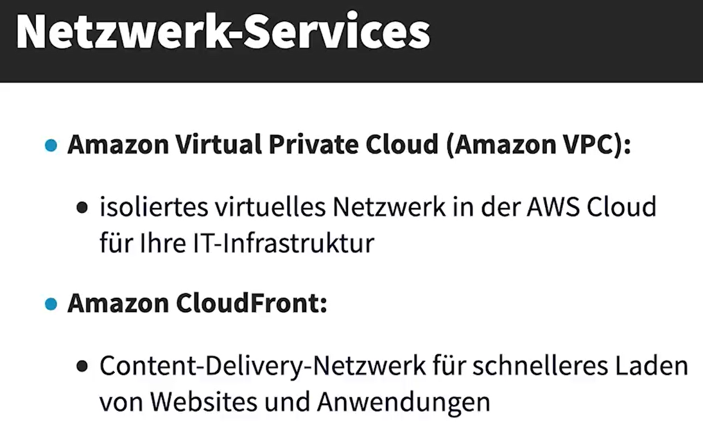

# Cloud-Technologie und -Services

[AWS Dienste](https://aws.amazon.com/de/products/?aws-products-all.sort-by=item.additionalFields.productNameLowercase&aws-products-all.sort-order=asc&awsf.re%3AInvent=*all&awsf.Free%20Tier%20Type=*all&awsf.tech-category=*all)

## Bereitstellung und Betrieb der AWS-Cloud

Benutzer können die Ressourcen verwalten, bei der Benutzung aus drei Platformen.

Die VPC ist eine Netzwerk, die für die Verbindung vielzahle Geräts verfügbar ist.

*Virtual private gateway:* A virtual private gateway is the Amazon VPC side of a VPN connection. It acts as the
termination point for VPN connections.

*Customer gateway:* A customer gateway is the on-premises side of a VPN connection. It is a physical or
software appliance that is connected to your on-premises network and is responsible for establishing the VPN
connection to your VPC.

>[!Note]
> The more loosely coupled the application components are, the better they will scale

>[!Note]
> A monolithic design refers to an architectural style where an application is built as a single, unified unit.
> 1. *Single Codebase:* All components of the application are part of one large codebase.
> 2. *Tightly Coupled:* Components are highly interdependent, making changes or scaling more challenging.
> 3. *Single Deployment:* The entire application is deployed as one unit, which can complicate updates and maintenance.
> 4. *Scalability Issues:* Scaling a monolithic application often requires scaling the entire application, rather than individual components.

An Availability Zone (AZ) is a component of the AWS global infrastructure that is made up of one or more discrete
data centers that have redundant power, networking, and connectivity. Each AZ is physically separated from Other
AZs within a region, and is designed to be fault-tolerant and provide low-latency networking.

## Compute-Services

>[!Note]
> *AWS Auto Scaling* monitors your applications and automatically adjusts capacity to mantain steady, predictable performance at the lowest possible cost. Using AWS Auto Scaling, it's easy to setup application scaling for multiple resources across multiple services in minutes

>[!Note]
> Amazon Machine Images (AMIs): An AMI is a pre-configured virtual machine image that contains the operating system,
> application software, and any Other required components needed to launch an instance. AMIs can be used to create new
> instances in the same or a different region, which can be useful for disaster recovery purposes.

Um detalierte Informationen über *Kubernetes* zu erfahren, clicken Sie hierzu:

[Kubernets](https://kuberntes.io)

## Speicher-Services

[Speicherklassen](https://aws.amazon.com/de/s3/storage-classes/)

>[!Note]
> In the *AWS Marketplace* it's possible to:
> - Sell solutions to other AWS users
> - Buy third-party software that runs on AWS 

## Datenbank-Services

In-Memory-Datenbanken sind Datenbankmanagementsysteme, die den Arbeitsspeicher (RAM) eines Computers als primären Datenspeicher nutzen. Im Gegensatz zu herkömmlichen Datenbanken,
die Festplattenlaufwerke verwenden, speichern In-Memory-Datenbanken alle Daten im RAM, was zu deutlich schnelleren Zugriffszeiten und einer höheren Verarbeitungsgeschwindigkeit führt.

## Netzwerk-Services

A VPC can span all Availability Zones within an AWS Region.

>[!Note]
> *VPC peering* is useful for establishing a connection between 2 VPCs in different AWS regions

>[!Note]
> _AWS Transit Gateway_ acts as a highly scalable cloud router. It conects your Amazon Virtual Private Clouds (VPCs) and on-premises networks through a central hub.

A *Content Delivery Network (CDN)* is a system of geographically distributed servers that work together to deliver web content quickly and efficiently to users. Here are some key points about CDNs:

- *Speed and Performance:* CDNs cache content close to end users, reducing latency and improving load times for websites.
- *Reliability:* By distributing content across multiple servers, CDNs can handle high traffic volumes and mitigate the impact of hardware failures.
- *Cost Efficiency:* CDNs reduce bandwidth costs by caching content, which decreases the load on the origin server.
- *Security:* CDNs offer protection against Distributed Denial of Service (DDoS) attacks and other security threats.

Popular CDN providers include Akamai Technologies, Cloudflare, Amazon CloudFront, Fastly, and Google Cloud CDN.

## Kunstliche Intelligenz, Machine Learning und Analytic Services
### KI/ML-Services

### Datenanalyse-Services

## Verwaltungstools

AWS CloudTrail allows AWS customers to record API calls, sending log files to Amazon
S3 buckets for storage.

>[!Note]
>
> Serverless applications:
> - AWS Fargate
> - AWS Step Functions
> - Amazon DynamoDB
> - Amazon SNS

## Andere Services

*AWS software development kits (SDKs)* allow users to connect with and deploy AWS services
programmatically. AWS provides SDKs for several popular programming languages, including Java, Python,
JavaScript, and C++.

>[!Note]
>
> *AWS Service Catalog* allows organizations to create and manage catalogs of IT services that are approved
> for use on AWS. These IT services can include everything from virtual machine images, servers, software,
> and databases to complete multi-tier application architectures.
>
> *AWS Service Catalog* can limit employees' access to a portfolio of predefined AWS resources

>[!Note]
>
> _AWS IAM Access Analyzer_ helps to identify the resources in your organization and accounts, such as Amazon S3 buckets or IAM roles, shared with an external entity.
> This lets you identify unintended access to your resources and data, which is a security task.

## Zusammenfassung

